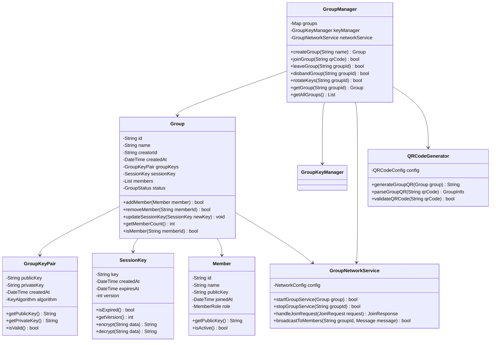
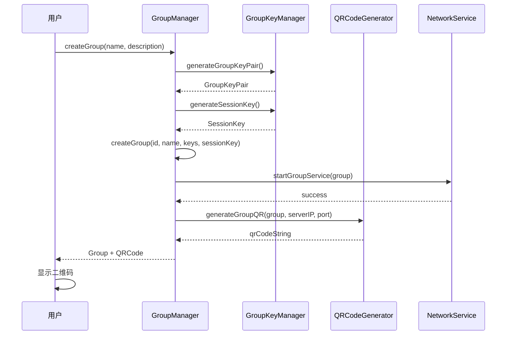
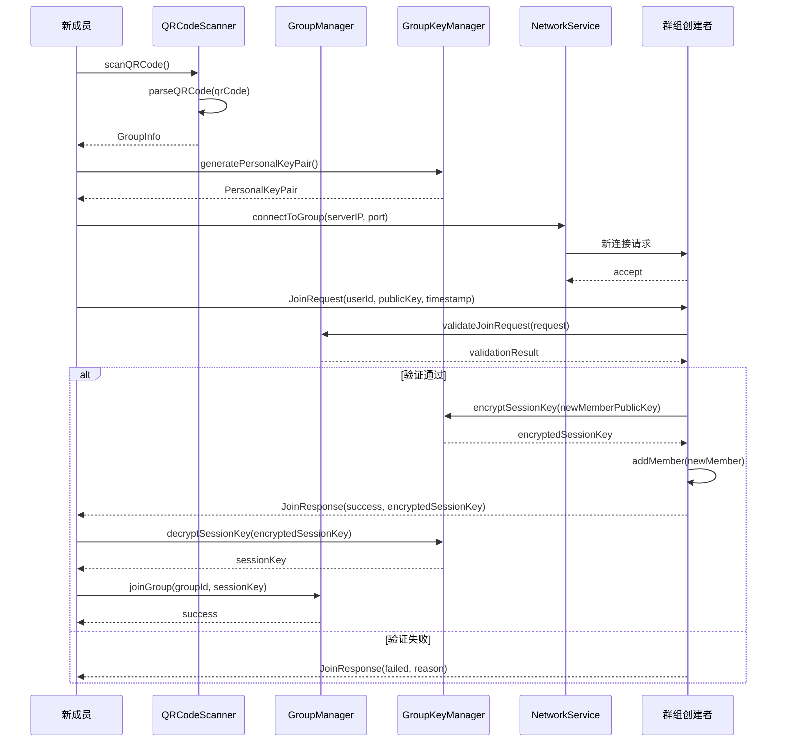
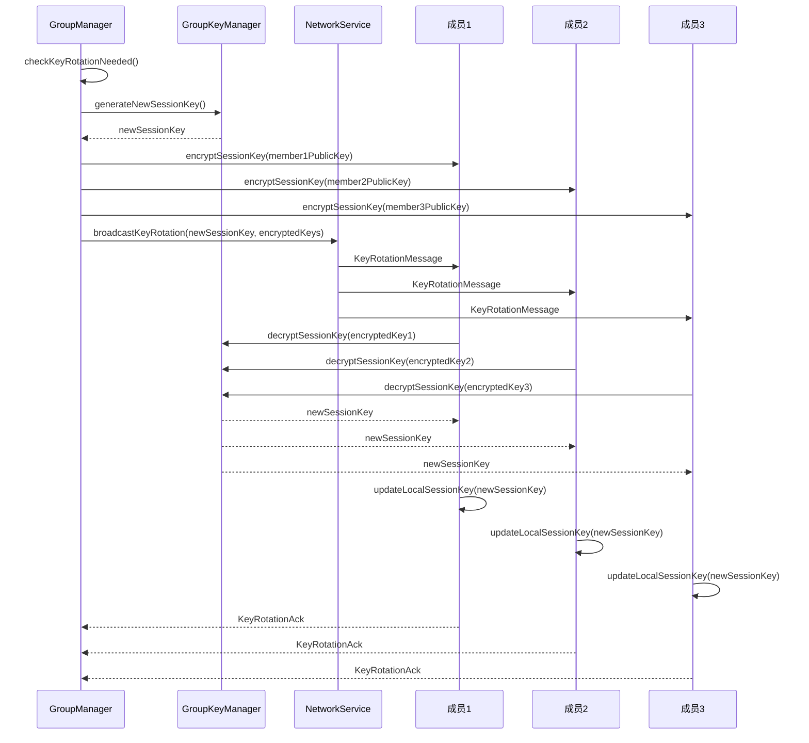

# 群组管理模块详细设计文档

## 1. 模块概述

群组管理模块负责处理群组的完整生命周期，包括创建、加入、退出、解散和密钥轮换等核心功能。该模块是端到端加密群聊系统的核心组件之一。

## 2. 模块结构设计

### 2.1 类结构图



### 2.2 数据结构设计

#### 2.2.1 Group 数据结构
```dart
class Group {
  final String id;                    // 群组唯一标识
  final String name;                  // 群组名称
  final String creatorId;             // 创建者ID
  final DateTime createdAt;           // 创建时间
  final GroupKeyPair groupKeys;       // 群组密钥对
  SessionKey sessionKey;              // 当前会话密钥
  final List<Member> members;         // 成员列表
  GroupStatus status;                 // 群组状态
  
  // 元数据
  final String description;           // 群组描述
  final int maxMembers;               // 最大成员数
  final GroupSettings settings;       // 群组设置
}

enum GroupStatus {
  active,     // 活跃
  inactive,   // 非活跃
  disbanded   // 已解散
}

enum MemberRole {
  creator,    // 创建者
  admin,      // 管理员
  member      // 普通成员
}
```

#### 2.2.2 二维码数据结构
```dart
class GroupQRCode {
  final String groupId;           // 群组ID
  final String creatorPublicKey;  // 创建者公钥
  final String groupPublicKey;    // 群组公钥
  final String serverIP;          // 服务器IP
  final int serverPort;           // 服务器端口
  final String encryptionMethod;  // 加密方法
  final DateTime expiresAt;       // 过期时间
  final String signature;         // 签名（防篡改）
}
```

## 3. 核心算法设计

### 3.1 群组ID生成算法
```dart
class GroupIdGenerator {
  static String generateGroupId() {
    // 使用UUID v4 + 时间戳 + 随机数
    final uuid = Uuid().v4();
    final timestamp = DateTime.now().millisecondsSinceEpoch;
    final random = Random().nextInt(10000);
    
    // 组合并哈希
    final combined = '$uuid$timestamp$random';
    final hash = sha256.convert(utf8.encode(combined));
    
    // 返回前16位作为群组ID
    return hash.toString().substring(0, 16);
  }
}
```

### 3.2 二维码生成算法
```dart
class QRCodeGenerator {
  static String generateGroupQR(Group group, String serverIP, int serverPort) {
    final qrData = GroupQRCode(
      groupId: group.id,
      creatorPublicKey: group.creatorPublicKey,
      groupPublicKey: group.groupKeys.publicKey,
      serverIP: serverIP,
      serverPort: serverPort,
      encryptionMethod: 'AES-256-GCM',
      expiresAt: DateTime.now().add(Duration(hours: 24)),
    );
    
    // 序列化数据
    final jsonData = jsonEncode(qrData.toJson());
    
    // 添加签名防篡改
    final signature = _signData(jsonData, group.groupKeys.privateKey);
    final signedData = '$jsonData.$signature';
    
    // Base64编码
    return base64Encode(utf8.encode(signedData));
  }
  
  static String _signData(String data, String privateKey) {
    // 使用ECDSA签名
    final signer = ECDSASigner(privateKey);
    return signer.sign(data);
  }
}
```

### 3.3 成员加入验证算法
```dart
class MemberJoinValidator {
  static bool validateJoinRequest(JoinRequest request, Group group) {
    // 1. 验证群组状态
    if (group.status != GroupStatus.active) {
      return false;
    }
    
    // 2. 验证成员数量限制
    if (group.members.length >= group.maxMembers) {
      return false;
    }
    
    // 3. 验证用户是否已存在
    if (group.isMember(request.userId)) {
      return false;
    }
    
    // 4. 验证公钥格式
    if (!_isValidPublicKey(request.publicKey)) {
      return false;
    }
    
    // 5. 验证时间戳（防重放攻击）
    final now = DateTime.now();
    final requestTime = DateTime.fromMillisecondsSinceEpoch(request.timestamp);
    if (now.difference(requestTime).abs().inMinutes > 5) {
      return false;
    }
    
    return true;
  }
}
```

## 4. 时序图设计

### 4.1 群组创建时序图



### 4.2 成员加入群组时序图



### 4.3 密钥轮换时序图



## 5. 接口设计

### 5.1 GroupManager 接口
```dart
abstract class IGroupManager {
  // 群组创建
  Future<Group> createGroup(String name, String description);
  
  // 群组加入
  Future<bool> joinGroup(String qrCode);
  
  // 群组退出
  Future<bool> leaveGroup(String groupId);
  
  // 群组解散
  Future<bool> disbandGroup(String groupId);
  
  // 密钥轮换
  Future<bool> rotateKeys(String groupId);
  
  // 获取群组信息
  Group? getGroup(String groupId);
  List<Group> getAllGroups();
  
  // 事件监听
  Stream<GroupEvent> get groupEvents;
}

enum GroupEventType {
  groupCreated,
  memberJoined,
  memberLeft,
  keysRotated,
  groupDisbanded
}

class GroupEvent {
  final GroupEventType type;
  final String groupId;
  final dynamic data;
  final DateTime timestamp;
}
```

### 5.2 网络接口
```dart
abstract class IGroupNetworkService {
  // 启动群组服务
  Future<bool> startGroupService(Group group);
  
  // 停止群组服务
  Future<bool> stopGroupService(String groupId);
  
  // 处理加入请求
  Future<JoinResponse> handleJoinRequest(JoinRequest request);
  
  // 广播消息
  Future<bool> broadcastToMembers(String groupId, Message message);
  
  // 连接状态
  Stream<ConnectionStatus> get connectionStatus;
}

class JoinRequest {
  final String userId;
  final String publicKey;
  final String groupId;
  final int timestamp;
  final String signature;
}

class JoinResponse {
  final bool success;
  final String? encryptedSessionKey;
  final String? reason;
}
```

## 6. 错误处理与异常

### 6.1 异常类型
```dart
class GroupException implements Exception {
  final String message;
  final GroupErrorCode code;
  
  GroupException(this.message, this.code);
}

enum GroupErrorCode {
  groupNotFound,
  groupFull,
  memberAlreadyExists,
  invalidQRCode,
  networkError,
  encryptionError,
  permissionDenied,
  keyRotationFailed
}
```

### 6.2 错误处理策略
```dart
class GroupErrorHandler {
  static Future<T> handleGroupOperation<T>(
    Future<T> Function() operation,
    String operationName,
  ) async {
    try {
      return await operation();
    } on GroupException catch (e) {
      _logError(operationName, e);
      _showUserFriendlyError(e);
      rethrow;
    } on NetworkException catch (e) {
      _handleNetworkError(e);
      rethrow;
    } catch (e) {
      _handleUnexpectedError(e);
      rethrow;
    }
  }
}
```

## 7. 性能优化

### 7.1 缓存策略
- 群组信息本地缓存
- 成员列表缓存
- 会话密钥缓存
- 二维码生成缓存

### 7.2 并发控制
- 群组操作互斥锁
- 成员变更原子操作
- 密钥轮换队列处理

### 7.3 内存管理
- 大群组分页加载
- 过期数据清理
- 弱引用使用

## 8. 安全考虑

### 8.1 数据验证
- 输入参数严格验证
- 二维码内容完整性校验
- 成员身份验证

### 8.2 权限控制
- 群组操作权限检查
- 成员角色权限管理
- 敏感操作二次确认

### 8.3 审计日志
- 群组操作日志记录
- 成员变更历史
- 密钥轮换记录

## 9. 测试策略

### 9.1 单元测试
- 群组创建/加入/退出逻辑
- 密钥生成和验证
- 二维码生成和解析

### 9.2 集成测试
- 端到端群组流程
- 网络通信测试
- 多成员并发测试

### 9.3 安全测试
- 密钥泄露测试
- 重放攻击测试
- 权限绕过测试

---

*本文档为群组管理模块的详细技术设计，开发时需严格按照此设计实现。* 