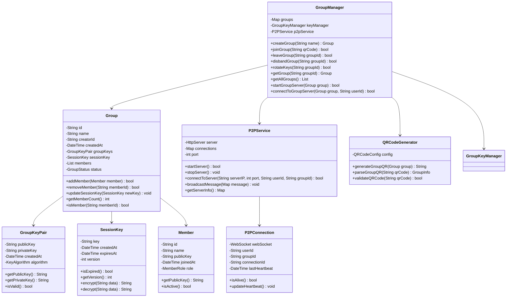
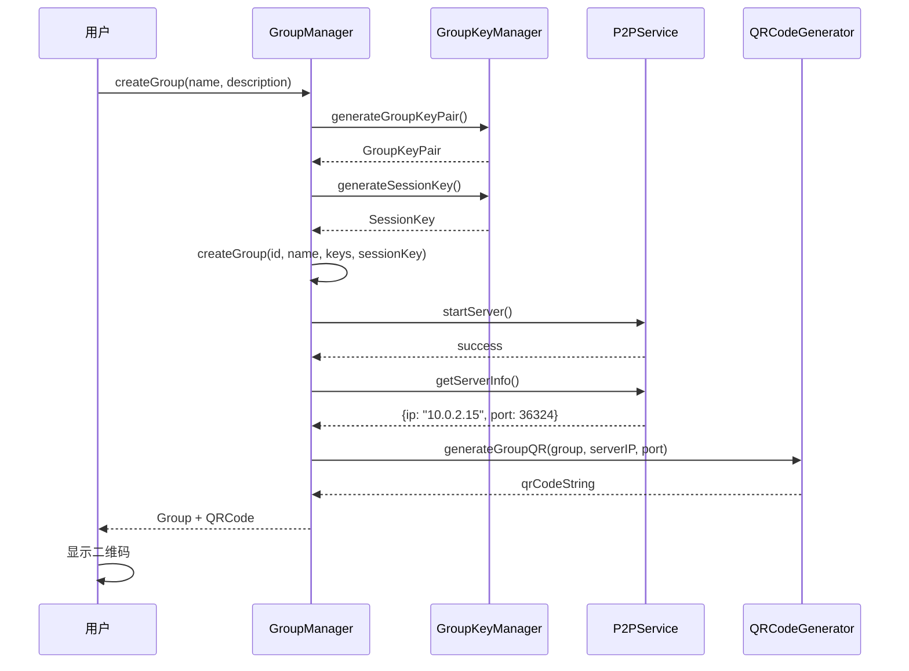
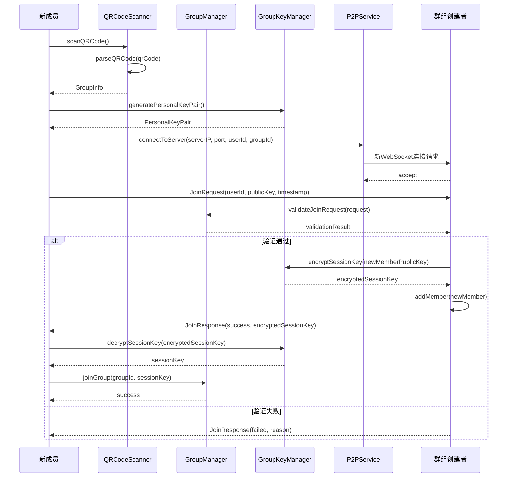
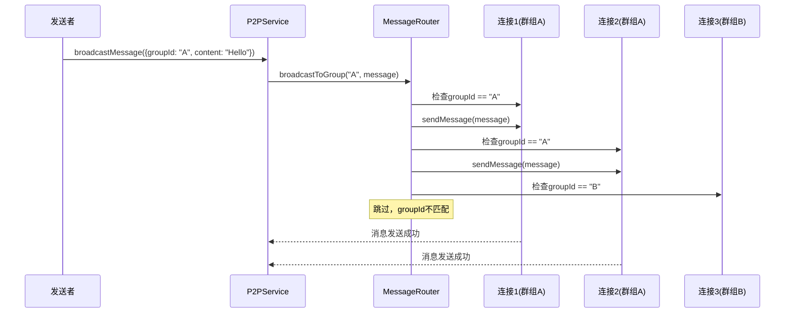

# 群组管理模块详细设计文档

## 1. 模块概述

群组管理模块负责处理群组的完整生命周期，包括创建、加入、退出、解散和密钥轮换等核心功能。该模块是端到端加密群聊系统的核心组件之一，采用单服务器多群组的P2P架构设计。

## 2. 模块结构设计

### 2.1 类结构图



### 2.2 数据结构设计

#### 2.2.1 Group 数据结构
```dart
class Group {
  final String id;                    // 群组唯一标识
  final String name;                  // 群组名称
  final String creatorId;             // 创建者ID
  final DateTime createdAt;           // 创建时间
  final GroupKeyPair groupKeys;       // 群组密钥对
  SessionKey sessionKey;              // 当前会话密钥
  final List<Member> members;         // 成员列表
  GroupStatus status;                 // 群组状态
  
  // 元数据
  final String description;           // 群组描述
  final int maxMembers;               // 最大成员数
  final GroupSettings settings;       // 群组设置
}

enum GroupStatus {
  active,     // 活跃
  unavailable, // 不可用（服务器离线）
  disbanded   // 已解散
}

enum MemberRole {
  creator,    // 创建者
  admin,      // 管理员
  member      // 普通成员
}
```

#### 2.2.2 二维码数据结构
```dart
class GroupQRCode {
  final String type;                  // 固定值: "group_join"
  final String groupId;               // 群组ID
  final String groupName;             // 群组名称
  final String serverIP;              // 服务器IP地址
  final int serverPort;               // 服务器端口
  final String sessionKey;            // 会话密钥（Base64编码）
}
```

#### 2.2.3 P2P连接数据结构
```dart
class P2PConnection {
  final WebSocket webSocket;          // WebSocket连接
  final String userId;                // 用户ID
  final String groupId;               // 群组ID（关键字段，用于消息路由）
  final String connectionId;          // 连接唯一标识
  DateTime lastHeartbeat;             // 最后心跳时间
  
  bool isAlive() {
    return DateTime.now().difference(lastHeartbeat) < Duration(seconds: 5);
  }
  
  void updateHeartbeat() {
    lastHeartbeat = DateTime.now();
  }
}
```

## 3. 核心算法设计

### 3.1 群组ID生成算法
```dart
class GroupIdGenerator {
  static String generateGroupId() {
    // 使用时间戳 + 随机数生成8位大写字母数字组合
    final timestamp = DateTime.now().millisecondsSinceEpoch;
    final random = Random().nextInt(10000);
    
    // 组合并哈希
    final combined = '$timestamp$random';
    final hash = sha256.convert(utf8.encode(combined));
    
    // 转换为8位大写字母数字组合
    final chars = 'ABCDEFGHIJKLMNOPQRSTUVWXYZ0123456789';
    String result = '';
    for (int i = 0; i < 8; i++) {
      final index = hash.bytes[i] % chars.length;
      result += chars[index];
    }
    
    return result;
  }
}
```

### 3.2 二维码生成算法
```dart
class QRCodeGenerator {
  static String generateGroupQR(Group group, String serverIP, int serverPort) {
    final qrData = {
      'type': 'group_join',
      'groupId': group.id,
      'groupName': group.name,
      'serverIP': serverIP,
      'serverPort': serverPort,
      'sessionKey': group.sessionKey.key,
    };
    
    // 序列化数据
    final jsonData = jsonEncode(qrData);
    
    // Base64编码（可选，用于URL安全传输）
    return base64Encode(utf8.encode(jsonData));
  }
  
  static GroupInfo parseGroupQR(String qrCode) {
    try {
      // Base64解码
      final decoded = utf8.decode(base64Decode(qrCode));
      final data = jsonDecode(decoded);
      
      return GroupInfo(
        groupId: data['groupId'],
        groupName: data['groupName'],
        serverIP: data['serverIP'],
        serverPort: data['serverPort'],
        sessionKey: data['sessionKey'],
      );
    } catch (e) {
      throw GroupException('Invalid QR code format', GroupErrorCode.invalidQRCode);
    }
  }
}
```

### 3.3 单服务器多群组消息路由算法
```dart
class MessageRouter {
  static void broadcastToGroup(String groupId, Map<String, dynamic> message) {
    final messageStr = jsonEncode(message);
    
    // 只发送给指定群组的连接
    for (var entry in P2PService._connections.entries) {
      final connection = entry.value;
      if (connection.groupId == groupId) {
        try {
          connection.webSocket.add(messageStr);
        } catch (e) {
          // 连接失败，移除连接
          P2PService._removeConnection(entry.key);
        }
      }
    }
  }
  
  static void sendToUser(String userId, String groupId, Map<String, dynamic> message) {
    final messageStr = jsonEncode(message);
    
    // 查找指定用户的连接
    for (var entry in P2PService._connections.entries) {
      final connection = entry.value;
      if (connection.userId == userId && connection.groupId == groupId) {
        try {
          connection.webSocket.add(messageStr);
          return;
        } catch (e) {
          P2PService._removeConnection(entry.key);
        }
      }
    }
  }
}
```

### 3.4 成员加入验证算法
```dart
class MemberJoinValidator {
  static bool validateJoinRequest(JoinRequest request, Group group) {
    // 1. 验证群组状态
    if (group.status != GroupStatus.active) {
      return false;
    }
    
    // 2. 验证成员数量限制
    if (group.members.length >= group.maxMembers) {
      return false;
    }
    
    // 3. 验证用户是否已存在
    if (group.isMember(request.userId)) {
      return false;
    }
    
    // 4. 验证公钥格式
    if (!_isValidPublicKey(request.publicKey)) {
      return false;
    }
    
    // 5. 验证时间戳（防重放攻击）
    final now = DateTime.now();
    final requestTime = DateTime.fromMillisecondsSinceEpoch(request.timestamp);
    if (now.difference(requestTime).abs().inMinutes > 5) {
      return false;
    }
    
    return true;
  }
}
```

## 4. 时序图设计

### 4.1 群组创建时序图



### 4.2 成员加入群组时序图



### 4.3 消息广播时序图



## 5. 接口设计

### 5.1 GroupManager 接口
```dart
abstract class IGroupManager {
  // 群组创建
  Future<Group> createGroup(String name, String description);
  
  // 群组加入
  Future<bool> joinGroup(String qrCode);
  
  // 群组退出
  Future<bool> leaveGroup(String groupId);
  
  // 群组解散
  Future<bool> disbandGroup(String groupId);
  
  // 密钥轮换
  Future<bool> rotateKeys(String groupId);
  
  // 获取群组信息
  Group? getGroup(String groupId);
  List<Group> getAllGroups();
  
  // P2P服务器管理
  Future<bool> startGroupServer(Group group);
  Future<bool> connectToGroupServer(Group group, String userId);
  Future<bool> ensureGroupServerRunning(Group group);
  
  // 群组状态管理
  Future<bool> checkGroupStatus(Group group);
  Future<bool> reconnectToGroup(Group group);
  Future<bool> restartGroupServer(Group group);
  
  // 事件监听
  Stream<GroupEvent> get groupEvents;
}

enum GroupEventType {
  groupCreated,
  memberJoined,
  memberLeft,
  keysRotated,
  groupDisbanded,
  serverStarted,
  serverStopped,
  connectionEstablished,
  connectionLost
}

class GroupEvent {
  final GroupEventType type;
  final String groupId;
  final dynamic data;
  final DateTime timestamp;
}
```

### 5.2 P2P服务接口
```dart
abstract class IP2PService {
  // 服务器管理
  Future<bool> startServer();
  Future<bool> stopServer();
  bool isServerRunning();
  
  // 客户端连接
  Future<bool> connectToServer(String serverIP, int port, String userId, String groupId);
  Future<bool> disconnect();
  
  // 消息发送
  void broadcastMessage(Map<String, dynamic> message);
  void sendToUser(String userId, String groupId, Map<String, dynamic> message);
  
  // 连接管理
  Map<String, P2PConnection> getConnections();
  int getConnectionCount();
  
  // 服务器信息
  Future<Map<String, dynamic>> getServerInfo();
  Map<String, dynamic> getServerStatus();
  
  // 网络测试
  Future<bool> testConnection(String targetIP, int port);
  Future<bool> pingTest(String targetIP);
  
  // 事件监听
  Stream<ConnectionEvent> get connectionEvents;
}

class ConnectionEvent {
  final ConnectionEventType type;
  final String connectionId;
  final String userId;
  final String groupId;
  final DateTime timestamp;
}

enum ConnectionEventType {
  connected,
  disconnected,
  messageReceived,
  error
}
```

## 6. 错误处理与异常

### 6.1 异常类型
```dart
class GroupException implements Exception {
  final String message;
  final GroupErrorCode code;
  
  GroupException(this.message, this.code);
}

enum GroupErrorCode {
  groupNotFound,
  groupFull,
  memberAlreadyExists,
  invalidQRCode,
  networkError,
  encryptionError,
  permissionDenied,
  keyRotationFailed,
  serverStartFailed,
  connectionFailed,
  serverUnavailable
}
```

### 6.2 错误处理策略
```dart
class GroupErrorHandler {
  static Future<T> handleGroupOperation<T>(
    Future<T> Function() operation,
    String operationName,
  ) async {
    try {
      return await operation();
    } on GroupException catch (e) {
      _logError(operationName, e);
      _showUserFriendlyError(e);
      rethrow;
    } on NetworkException catch (e) {
      _handleNetworkError(e);
      rethrow;
    } catch (e) {
      _handleUnexpectedError(e);
      rethrow;
    }
  }
}
```

## 7. 性能优化

### 7.1 缓存策略
- 群组信息本地缓存
- 成员列表缓存
- 会话密钥缓存
- 二维码生成缓存

### 7.2 并发控制
- 群组操作互斥锁
- 成员变更原子操作
- 密钥轮换队列处理
- 连接池管理

### 7.3 内存管理
- 大群组分页加载
- 过期数据清理
- 弱引用使用
- 连接超时清理

## 8. 安全考虑

### 8.1 数据验证
- 输入参数严格验证
- 二维码内容完整性校验
- 成员身份验证
- 消息格式验证

### 8.2 权限控制
- 群组操作权限检查
- 成员角色权限管理
- 敏感操作二次确认
- 连接验证机制

### 8.3 审计日志
- 群组操作日志记录
- 成员变更历史
- 密钥轮换记录
- 连接事件日志

## 9. 测试策略

### 9.1 单元测试
- 群组创建/加入/退出逻辑
- 密钥生成和验证
- 二维码生成和解析
- 消息路由算法

### 9.2 集成测试
- 端到端群组流程
- 网络通信测试
- 多成员并发测试
- 单服务器多群组测试

### 9.3 安全测试
- 密钥泄露测试
- 重放攻击测试
- 权限绕过测试
- 连接劫持测试

---

*本文档为群组管理模块的详细技术设计，开发时需严格按照此设计实现。* 