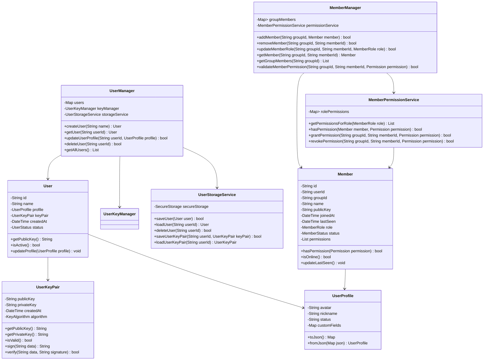
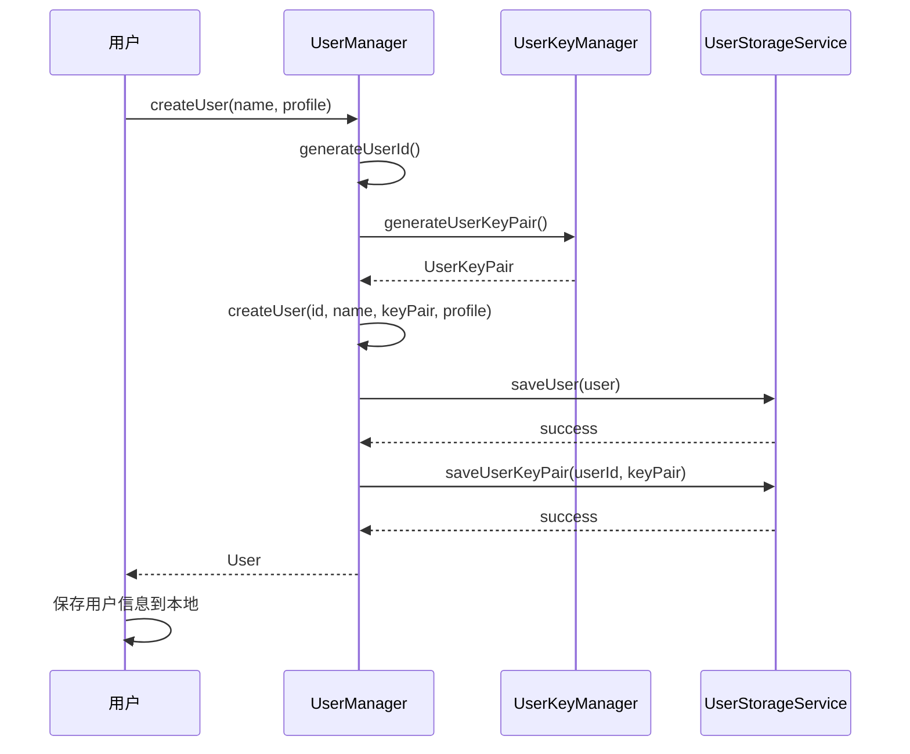
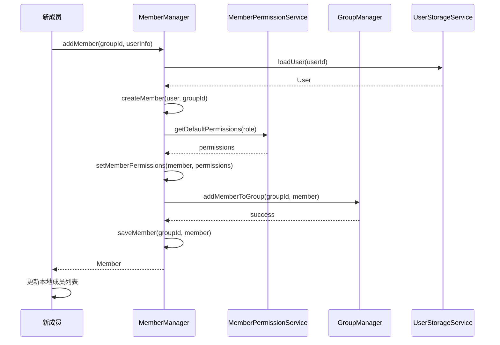
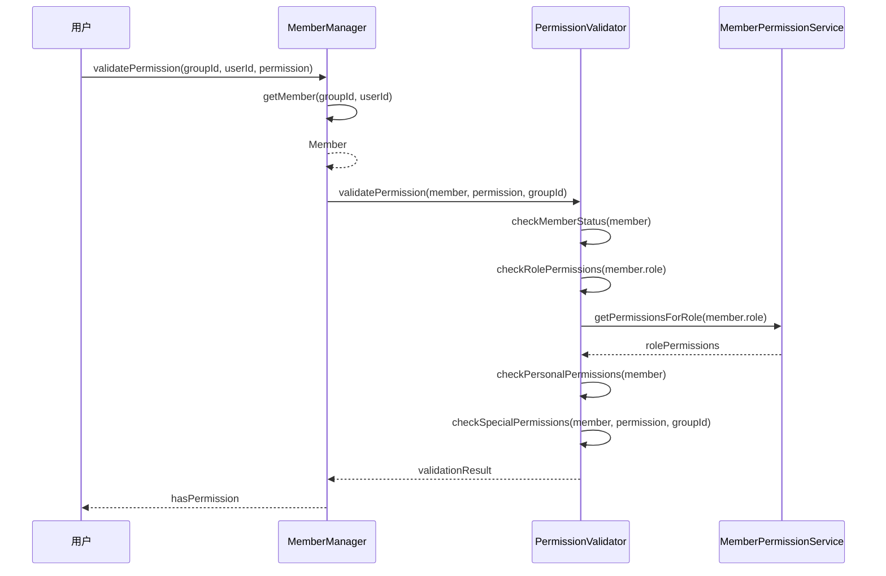
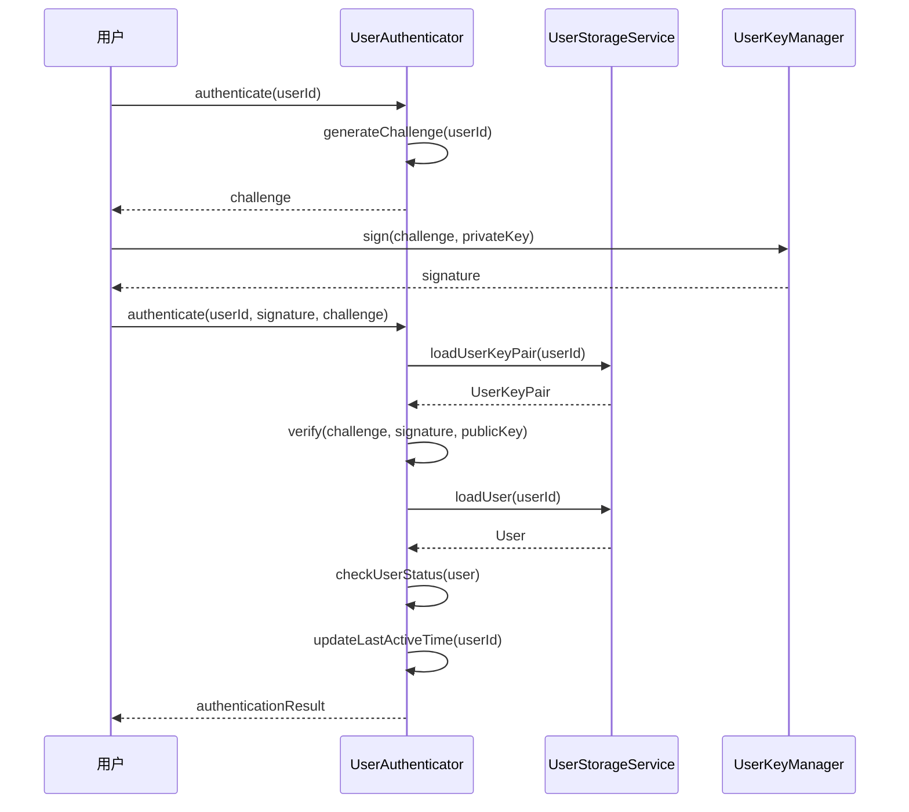

# 用户与成员管理模块详细设计文档

## 1. 模块概述

用户与成员管理模块负责处理用户身份标识、成员加入/退出流程、权限模型等核心功能。该模块确保群组中每个成员都有唯一的身份标识，并管理成员在群组中的权限和状态。

## 2. 模块结构设计

### 2.1 类结构图



### 2.2 数据结构设计

#### 2.2.1 User 数据结构
```dart
class User {
  final String id;                    // 用户唯一标识
  final String name;                  // 用户名称
  UserProfile profile;                // 用户资料
  final UserKeyPair keyPair;          // 用户密钥对
  final DateTime createdAt;           // 创建时间
  UserStatus status;                  // 用户状态
  final DateTime lastActiveAt;        // 最后活跃时间
  
  // 安全相关
  final String deviceId;              // 设备标识
  final List<String> sessionTokens;   // 会话令牌列表
}

enum UserStatus {
  active,     // 活跃
  inactive,   // 非活跃
  suspended,  // 暂停
  deleted     // 已删除
}

class UserProfile {
  String? avatar;                     // 头像URL
  String? nickname;                   // 昵称
  String? status;                     // 状态信息
  String? email;                      // 邮箱
  String? phone;                      // 电话
  Map<String, dynamic> customFields;  // 自定义字段
  
  UserProfile({
    this.avatar,
    this.nickname,
    this.status,
    this.email,
    this.phone,
    Map<String, dynamic>? customFields,
  }) : customFields = customFields ?? {};
}
```

#### 2.2.2 Member 数据结构
```dart
class Member {
  final String id;                    // 成员唯一标识
  final String userId;                // 用户ID
  final String groupId;               // 群组ID
  final String name;                  // 成员名称
  final String publicKey;             // 成员公钥
  final DateTime joinedAt;            // 加入时间
  DateTime lastSeen;                  // 最后在线时间
  MemberRole role;                    // 成员角色
  MemberStatus status;                // 成员状态
  final List<Permission> permissions; // 权限列表
  
  // 群组内特定信息
  String? groupNickname;              // 群内昵称
  bool isMuted;                       // 是否被禁言
  DateTime? mutedUntil;               // 禁言截止时间
}

enum MemberRole {
  creator,    // 创建者（最高权限）
  admin,      // 管理员
  moderator,  // 版主
  member      // 普通成员
}

enum MemberStatus {
  active,     // 活跃
  inactive,   // 非活跃
  kicked,     // 被踢出
  left        // 主动离开
}

enum Permission {
  // 消息权限
  sendMessage,        // 发送消息
  sendFile,           // 发送文件
  sendImage,          // 发送图片
  sendVoice,          // 发送语音
  
  // 群组管理权限
  inviteMember,       // 邀请成员
  kickMember,         // 踢出成员
  changeGroupInfo,    // 修改群组信息
  changeMemberRole,   // 修改成员角色
  
  // 高级权限
  rotateKeys,         // 轮换密钥
  viewGroupLogs,      // 查看群组日志
  deleteGroup,        // 删除群组
}
```

## 3. 核心算法设计

### 3.1 用户ID生成算法
```dart
class UserIdGenerator {
  static String generateUserId() {
    // 使用设备信息 + 时间戳 + 随机数
    final deviceInfo = _getDeviceInfo();
    final timestamp = DateTime.now().millisecondsSinceEpoch;
    final random = Random().nextInt(100000);
    
    // 组合并哈希
    final combined = '$deviceInfo$timestamp$random';
    final hash = sha256.convert(utf8.encode(combined));
    
    // 返回前20位作为用户ID
    return hash.toString().substring(0, 20);
  }
  
  static String _getDeviceInfo() {
    // 获取设备唯一标识
    final deviceId = DeviceInfoPlugin().androidId ?? 
                    DeviceInfoPlugin().identifierForVendor ?? 
                    'unknown';
    return deviceId;
  }
}
```

### 3.2 成员权限验证算法
```dart
class PermissionValidator {
  static bool validatePermission(
    Member member, 
    Permission permission, 
    String groupId
  ) {
    // 1. 检查成员状态
    if (member.status != MemberStatus.active) {
      return false;
    }
    
    // 2. 检查角色权限
    final rolePermissions = _getRolePermissions(member.role);
    if (rolePermissions.contains(permission)) {
      return true;
    }
    
    // 3. 检查个人权限
    if (member.permissions.contains(permission)) {
      return true;
    }
    
    // 4. 特殊权限检查
    return _checkSpecialPermissions(member, permission, groupId);
  }
  
  static List<Permission> _getRolePermissions(MemberRole role) {
    switch (role) {
      case MemberRole.creator:
        return Permission.values; // 创建者拥有所有权限
      case MemberRole.admin:
        return [
          Permission.sendMessage,
          Permission.sendFile,
          Permission.sendImage,
          Permission.sendVoice,
          Permission.inviteMember,
          Permission.kickMember,
          Permission.changeGroupInfo,
          Permission.changeMemberRole,
          Permission.rotateKeys,
          Permission.viewGroupLogs,
        ];
      case MemberRole.moderator:
        return [
          Permission.sendMessage,
          Permission.sendFile,
          Permission.sendImage,
          Permission.sendVoice,
          Permission.inviteMember,
          Permission.kickMember,
        ];
      case MemberRole.member:
        return [
          Permission.sendMessage,
          Permission.sendFile,
          Permission.sendImage,
          Permission.sendVoice,
        ];
    }
  }
  
  static bool _checkSpecialPermissions(
    Member member, 
    Permission permission, 
    String groupId
  ) {
    // 特殊权限逻辑
    switch (permission) {
      case Permission.deleteGroup:
        return member.role == MemberRole.creator;
      case Permission.rotateKeys:
        return member.role == MemberRole.creator || 
               member.role == MemberRole.admin;
      default:
        return false;
    }
  }
}
```

### 3.3 用户身份验证算法
```dart
class UserAuthenticator {
  static Future<bool> authenticateUser(
    String userId, 
    String signature, 
    String challenge
  ) async {
    try {
      // 1. 获取用户密钥对
      final userKeyPair = await UserStorageService().loadUserKeyPair(userId);
      if (userKeyPair == null) {
        return false;
      }
      
      // 2. 验证签名
      final isValid = userKeyPair.verify(challenge, signature);
      if (!isValid) {
        return false;
      }
      
      // 3. 检查用户状态
      final user = await UserStorageService().loadUser(userId);
      if (user?.status != UserStatus.active) {
        return false;
      }
      
      // 4. 更新最后活跃时间
      await _updateLastActiveTime(userId);
      
      return true;
    } catch (e) {
      _logError('User authentication failed', e);
      return false;
    }
  }
  
  static Future<String> generateChallenge(String userId) async {
    // 生成随机挑战字符串
    final random = Random.secure();
    final challenge = base64Encode(
      List<int>.generate(32, (i) => random.nextInt(256))
    );
    
    // 存储挑战（用于后续验证）
    await _storeChallenge(userId, challenge);
    
    return challenge;
  }
}
```

## 4. 时序图设计

### 4.1 用户注册时序图



### 4.2 成员加入群组时序图



### 4.3 权限验证时序图



### 4.4 用户身份验证时序图



## 5. 接口设计

### 5.1 UserManager 接口
```dart
abstract class IUserManager {
  // 用户创建
  Future<User> createUser(String name, UserProfile profile);
  
  // 用户获取
  User? getUser(String userId);
  List<User> getAllUsers();
  
  // 用户更新
  Future<bool> updateUserProfile(String userId, UserProfile profile);
  Future<bool> updateUserStatus(String userId, UserStatus status);
  
  // 用户删除
  Future<bool> deleteUser(String userId);
  
  // 用户认证
  Future<bool> authenticateUser(String userId, String signature, String challenge);
  Future<String> generateChallenge(String userId);
  
  // 事件监听
  Stream<UserEvent> get userEvents;
}

class UserEvent {
  final UserEventType type;
  final String userId;
  final dynamic data;
  final DateTime timestamp;
}

enum UserEventType {
  userCreated,
  userUpdated,
  userDeleted,
  userAuthenticated
}
```

### 5.2 MemberManager 接口
```dart
abstract class IMemberManager {
  // 成员管理
  Future<bool> addMember(String groupId, Member member);
  Future<bool> removeMember(String groupId, String memberId);
  Future<bool> updateMemberRole(String groupId, String memberId, MemberRole role);
  
  // 成员查询
  Member? getMember(String groupId, String memberId);
  List<Member> getGroupMembers(String groupId);
  List<Member> getOnlineMembers(String groupId);
  
  // 权限管理
  Future<bool> validateMemberPermission(String groupId, String memberId, Permission permission);
  Future<bool> grantPermission(String groupId, String memberId, Permission permission);
  Future<bool> revokePermission(String groupId, String memberId, Permission permission);
  
  // 成员状态
  Future<bool> updateMemberStatus(String groupId, String memberId, MemberStatus status);
  Future<bool> updateLastSeen(String groupId, String memberId);
  
  // 事件监听
  Stream<MemberEvent> get memberEvents;
}

class MemberEvent {
  final MemberEventType type;
  final String groupId;
  final String memberId;
  final dynamic data;
  final DateTime timestamp;
}

enum MemberEventType {
  memberJoined,
  memberLeft,
  memberKicked,
  roleChanged,
  permissionChanged,
  statusChanged
}
```

## 6. 错误处理与异常

### 6.1 异常类型
```dart
class UserException implements Exception {
  final String message;
  final UserErrorCode code;
  
  UserException(this.message, this.code);
}

class MemberException implements Exception {
  final String message;
  final MemberErrorCode code;
  
  MemberException(this.message, this.code);
}

enum UserErrorCode {
  userNotFound,
  userAlreadyExists,
  invalidUserData,
  authenticationFailed,
  keyPairGenerationFailed,
  storageError
}

enum MemberErrorCode {
  memberNotFound,
  memberAlreadyExists,
  invalidMemberData,
  permissionDenied,
  roleChangeFailed,
  groupNotFound
}
```

### 6.2 错误处理策略
```dart
class UserErrorHandler {
  static Future<T> handleUserOperation<T>(
    Future<T> Function() operation,
    String operationName,
  ) async {
    try {
      return await operation();
    } on UserException catch (e) {
      _logError(operationName, e);
      _showUserFriendlyError(e);
      rethrow;
    } on StorageException catch (e) {
      _handleStorageError(e);
      rethrow;
    } catch (e) {
      _handleUnexpectedError(e);
      rethrow;
    }
  }
}
```

## 7. 性能优化

### 7.1 缓存策略
- 用户信息本地缓存
- 成员列表缓存
- 权限验证结果缓存
- 用户密钥对缓存

### 7.2 并发控制
- 用户操作互斥锁
- 成员变更原子操作
- 权限验证并发控制

### 7.3 内存管理
- 大群组成员分页加载
- 过期用户数据清理
- 弱引用使用

## 8. 安全考虑

### 8.1 身份验证
- 强密码策略
- 多因素认证
- 会话管理
- 设备绑定

### 8.2 权限控制
- 最小权限原则
- 权限继承机制
- 权限审计日志
- 权限动态调整

### 8.3 数据保护
- 敏感信息加密存储
- 数据传输加密
- 访问日志记录
- 数据备份策略

## 9. 测试策略

### 9.1 单元测试
- 用户创建/更新/删除逻辑
- 成员权限验证
- 身份认证流程
- 密钥生成和验证

### 9.2 集成测试
- 端到端用户流程
- 成员管理流程
- 权限系统测试
- 多用户并发测试

### 9.3 安全测试
- 身份验证绕过测试
- 权限提升测试
- 数据泄露测试
- 会话劫持测试

---

*本文档为用户与成员管理模块的详细技术设计，开发时需严格按照此设计实现。* 