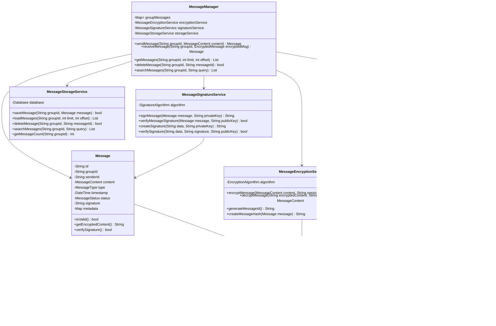

# 消息系统模块详细设计文档

## 1. 模块概述

消息系统模块负责处理群组内消息的发送、接收、加密、解密、签名验证等核心功能。该模块确保消息的端到端加密、完整性验证、防重放攻击等安全特性。

## 2. 模块结构设计

### 2.1 类结构图



### 2.2 数据结构设计

#### 2.2.1 Message 数据结构
```dart
class Message {
  final String id;                    // 消息唯一标识
  final String groupId;               // 群组ID
  final String senderId;              // 发送者ID
  final MessageContent content;       // 消息内容
  final MessageType type;             // 消息类型
  final DateTime timestamp;           // 发送时间戳
  MessageStatus status;               // 消息状态
  final String signature;             // 消息签名
  final Map<String, dynamic> metadata; // 元数据
  
  // 消息序列号（防重放）
  final int sequenceNumber;
  
  // 消息引用（回复功能）
  final String? replyToMessageId;
  
  // 消息编辑历史
  final List<MessageEdit> editHistory;
}

enum MessageType {
  text,       // 文本消息
  image,      // 图片消息
  file,       // 文件消息
  voice,      // 语音消息
  video,      // 视频消息
  location,   // 位置消息
  system,     // 系统消息
  encrypted   // 加密消息
}

enum MessageStatus {
  sending,    // 发送中
  sent,       // 已发送
  delivered,  // 已送达
  read,       // 已读
  failed,     // 发送失败
  deleted     // 已删除
}

class MessageContent {
  final String text;                  // 文本内容
  final MessageType type;             // 消息类型
  final Map<String, dynamic> data;    // 附加数据
  final int size;                     // 消息大小
  
  // 文件相关
  final String? filePath;             // 文件路径
  final String? fileName;             // 文件名
  final String? mimeType;             // MIME类型
  
  // 媒体相关
  final String? mediaUrl;             // 媒体URL
  final int? duration;                // 时长（音频/视频）
  final int? width;                   // 宽度（图片/视频）
  final int? height;                  // 高度（图片/视频）
}
```

#### 2.2.2 EncryptedMessage 数据结构
```dart
class EncryptedMessage {
  final String messageId;             // 消息ID
  final String groupId;               // 群组ID
  final String senderId;              // 发送者ID
  final String encryptedContent;      // 加密内容
  final String signature;             // 签名
  final DateTime timestamp;           // 时间戳
  final int sequenceNumber;           // 序列号
  final MessageType type;             // 消息类型
  
  // 加密相关
  final String encryptionAlgorithm;   // 加密算法
  final String iv;                    // 初始化向量
  final String authTag;               // 认证标签
  
  // 密钥相关
  final String keyId;                 // 密钥ID
  final int keyVersion;               // 密钥版本
}
```

## 3. 核心算法设计

### 3.1 消息ID生成算法
```dart
class MessageIdGenerator {
  static String generateMessageId(String senderId, String groupId) {
    // 使用发送者ID + 群组ID + 时间戳 + 随机数
    final timestamp = DateTime.now().millisecondsSinceEpoch;
    final random = Random.secure().nextInt(1000000);
    
    // 组合并哈希
    final combined = '$senderId$groupId$timestamp$random';
    final hash = sha256.convert(utf8.encode(combined));
    
    // 返回前24位作为消息ID
    return hash.toString().substring(0, 24);
  }
  
  static String generateSequenceNumber(String groupId) {
    // 基于群组ID和时间生成序列号
    final timestamp = DateTime.now().millisecondsSinceEpoch;
    final groupHash = sha256.convert(utf8.encode(groupId));
    final groupNumber = int.parse(groupHash.toString().substring(0, 8), radix: 16);
    
    return (timestamp + groupNumber).toString();
  }
}
```

### 3.2 消息加密算法
```dart
class MessageEncryptionService {
  static String encryptMessage(MessageContent content, String sessionKey) {
    try {
      // 1. 序列化消息内容
      final jsonData = jsonEncode(content.toJson());
      final dataBytes = utf8.encode(jsonData);
      
      // 2. 生成随机IV
      final iv = _generateRandomIV();
      
      // 3. 使用AES-256-GCM加密
      final cipher = GCMBlockCipher(AESEngine());
      final params = AEADParameters(
        KeyParameter(utf8.encode(sessionKey)),
        128, // 认证标签长度
        iv,
      );
      
      cipher.init(true, params);
      
      final encryptedBytes = cipher.process(dataBytes);
      final authTag = cipher.mac;
      
      // 4. 组合加密结果
      final result = {
        'iv': base64Encode(iv),
        'data': base64Encode(encryptedBytes),
        'tag': base64Encode(authTag),
        'algorithm': 'AES-256-GCM',
      };
      
      return jsonEncode(result);
    } catch (e) {
      throw MessageEncryptionException('Failed to encrypt message: $e');
    }
  }
  
  static MessageContent decryptMessage(String encryptedData, String sessionKey) {
    try {
      // 1. 解析加密数据
      final data = jsonDecode(encryptedData);
      final iv = base64Decode(data['iv']);
      final encryptedBytes = base64Decode(data['data']);
      final authTag = base64Decode(data['tag']);
      
      // 2. 使用AES-256-GCM解密
      final cipher = GCMBlockCipher(AESEngine());
      final params = AEADParameters(
        KeyParameter(utf8.encode(sessionKey)),
        128,
        iv,
      );
      
      cipher.init(false, params);
      
      final decryptedBytes = cipher.process(encryptedBytes);
      
      // 3. 验证认证标签
      if (!_verifyAuthTag(cipher.mac, authTag)) {
        throw MessageEncryptionException('Authentication tag verification failed');
      }
      
      // 4. 反序列化消息内容
      final jsonString = utf8.decode(decryptedBytes);
      final jsonData = jsonDecode(jsonString);
      
      return MessageContent.fromJson(jsonData);
    } catch (e) {
      throw MessageEncryptionException('Failed to decrypt message: $e');
    }
  }
  
  static Uint8List _generateRandomIV() {
    final random = Random.secure();
    return Uint8List.fromList(
      List<int>.generate(12, (i) => random.nextInt(256))
    );
  }
  
  static bool _verifyAuthTag(Uint8List computed, Uint8List expected) {
    if (computed.length != expected.length) return false;
    for (int i = 0; i < computed.length; i++) {
      if (computed[i] != expected[i]) return false;
    }
    return true;
  }
}
```

### 3.3 消息签名算法
```dart
class MessageSignatureService {
  static String signMessage(Message message, String privateKey) {
    try {
      // 1. 创建消息哈希
      final messageHash = _createMessageHash(message);
      
      // 2. 使用ECDSA签名
      final signer = ECDSASigner();
      final keyParams = ECPrivateKeyParameters(
        BigInt.parse(privateKey, radix: 16),
        ECDomainParameters(
          ECCurve_secp256r1(),
          ECCurve_secp256r1().G,
          ECCurve_secp256r1().N,
        ),
      );
      
      signer.init(true, PrivateKeyParameter(keyParams));
      
      final signature = signer.generateSignature(messageHash);
      
      // 3. 编码签名
      return base64Encode(signature.bytes);
    } catch (e) {
      throw MessageSignatureException('Failed to sign message: $e');
    }
  }
  
  static bool verifyMessageSignature(Message message, String publicKey) {
    try {
      // 1. 创建消息哈希
      final messageHash = _createMessageHash(message);
      
      // 2. 解码签名
      final signatureBytes = base64Decode(message.signature);
      final signature = ECSignature.fromBytes(signatureBytes);
      
      // 3. 使用ECDSA验签
      final verifier = ECDSASigner();
      final keyParams = ECPublicKeyParameters(
        ECCurve_secp256r1().decodePoint(base64Decode(publicKey)),
        ECDomainParameters(
          ECCurve_secp256r1(),
          ECCurve_secp256r1().G,
          ECCurve_secp256r1().N,
        ),
      );
      
      verifier.init(false, PublicKeyParameter(keyParams));
      
      return verifier.verifySignature(messageHash, signature);
    } catch (e) {
      _logError('Signature verification failed', e);
      return false;
    }
  }
  
  static Uint8List _createMessageHash(Message message) {
    // 创建消息哈希（排除签名字段）
    final dataToHash = {
      'id': message.id,
      'groupId': message.groupId,
      'senderId': message.senderId,
      'content': message.content.toJson(),
      'type': message.type.toString(),
      'timestamp': message.timestamp.millisecondsSinceEpoch,
      'sequenceNumber': message.sequenceNumber,
    };
    
    final jsonString = jsonEncode(dataToHash);
    final hash = sha256.convert(utf8.encode(jsonString));
    
    return Uint8List.fromList(hash.bytes);
  }
}
```

### 3.4 消息重放保护算法
```dart
class MessageReplayProtection {
  static final Map<String, Set<String>> _processedMessages = {};
  static final int _maxStoredMessages = 10000;
  static final Duration _messageWindow = Duration(minutes: 5);
  
  static bool isReplayAttack(Message message) {
    final key = '${message.groupId}_${message.senderId}';
    
    // 1. 检查消息是否已处理
    if (_processedMessages[key]?.contains(message.id) == true) {
      return true;
    }
    
    // 2. 检查时间窗口
    final now = DateTime.now();
    final messageTime = message.timestamp;
    if (now.difference(messageTime).abs() > _messageWindow) {
      return true;
    }
    
    // 3. 检查序列号
    if (!_isValidSequenceNumber(message)) {
      return true;
    }
    
    // 4. 记录已处理的消息
    _recordProcessedMessage(key, message.id);
    
    return false;
  }
  
  static bool _isValidSequenceNumber(Message message) {
    // 实现序列号验证逻辑
    // 检查序列号是否在合理范围内
    // 检查序列号是否递增
    return true; // 简化实现
  }
  
  static void _recordProcessedMessage(String key, String messageId) {
    if (!_processedMessages.containsKey(key)) {
      _processedMessages[key] = {};
    }
    
    _processedMessages[key]!.add(messageId);
    
    // 清理过期消息
    if (_processedMessages[key]!.length > _maxStoredMessages) {
      _cleanupOldMessages(key);
    }
  }
  
  static void _cleanupOldMessages(String key) {
    // 清理最旧的消息记录
    final messages = _processedMessages[key]!.toList();
    messages.sort();
    _processedMessages[key] = messages.take(_maxStoredMessages ~/ 2).toSet();
  }
}
```

## 4. 时序图设计

### 4.1 消息发送时序图


### 4.2 消息接收时序图


### 4.3 消息重试时序图


## 5. 接口设计

### 5.1 MessageManager 接口
```dart
abstract class IMessageManager {
  // 消息发送
  Future<Message> sendMessage(String groupId, MessageContent content);
  Future<bool> sendEncryptedMessage(String groupId, EncryptedMessage message);
  
  // 消息接收
  Future<Message?> receiveMessage(String groupId, EncryptedMessage encryptedMessage);
  Future<List<Message>> receiveMessages(String groupId, List<EncryptedMessage> messages);
  
  // 消息查询
  Future<List<Message>> getMessages(String groupId, {int limit = 50, int offset = 0});
  Future<List<Message>> searchMessages(String groupId, String query);
  Future<Message?> getMessage(String groupId, String messageId);
  
  // 消息管理
  Future<bool> deleteMessage(String groupId, String messageId);
  Future<bool> editMessage(String groupId, String messageId, MessageContent newContent);
  Future<bool> markAsRead(String groupId, String messageId);
  
  // 消息状态
  Future<bool> updateMessageStatus(String groupId, String messageId, MessageStatus status);
  Stream<MessageStatusUpdate> get messageStatusUpdates;
  
  // 事件监听
  Stream<MessageEvent> get messageEvents;
}

class MessageEvent {
  final MessageEventType type;
  final String groupId;
  final String messageId;
  final dynamic data;
  final DateTime timestamp;
}

enum MessageEventType {
  messageSent,
  messageReceived,
  messageDelivered,
  messageRead,
  messageFailed,
  messageDeleted,
  messageEdited
}

class MessageStatusUpdate {
  final String groupId;
  final String messageId;
  final MessageStatus status;
  final DateTime timestamp;
}
```

### 5.2 消息加密接口
```dart
abstract class IMessageEncryptionService {
  // 消息加密
  String encryptMessage(MessageContent content, String sessionKey);
  String encryptMessageWithAlgorithm(MessageContent content, String key, String algorithm);
  
  // 消息解密
  MessageContent decryptMessage(String encryptedData, String sessionKey);
  MessageContent decryptMessageWithAlgorithm(String encryptedData, String key, String algorithm);
  
  // 密钥管理
  String generateSessionKey();
  String deriveKey(String baseKey, String salt);
  
  // 工具方法
  String generateMessageId();
  Uint8List generateRandomBytes(int length);
}
```

### 5.3 消息签名接口
```dart
abstract class IMessageSignatureService {
  // 消息签名
  String signMessage(Message message, String privateKey);
  String signData(String data, String privateKey);
  
  // 签名验证
  bool verifyMessageSignature(Message message, String publicKey);
  bool verifySignature(String data, String signature, String publicKey);
  
  // 密钥管理
  String generateKeyPair();
  String getPublicKey(String privateKey);
  
  // 工具方法
  String createMessageHash(Message message);
  String createDataHash(String data);
}
```

## 6. 错误处理与异常

### 6.1 异常类型
```dart
class MessageException implements Exception {
  final String message;
  final MessageErrorCode code;
  
  MessageException(this.message, this.code);
}

class MessageEncryptionException implements Exception {
  final String message;
  final String details;
  
  MessageEncryptionException(this.message, [this.details = '']);
}

class MessageSignatureException implements Exception {
  final String message;
  final String details;
  
  MessageSignatureException(this.message, [this.details = '']);
}

enum MessageErrorCode {
  messageNotFound,
  messageSendFailed,
  messageReceiveFailed,
  encryptionFailed,
  decryptionFailed,
  signatureInvalid,
  replayAttack,
  networkError,
  storageError,
  permissionDenied
}
```

### 6.2 错误处理策略
```dart
class MessageErrorHandler {
  static Future<T> handleMessageOperation<T>(
    Future<T> Function() operation,
    String operationName,
  ) async {
    try {
      return await operation();
    } on MessageEncryptionException catch (e) {
      _logError('Encryption error in $operationName', e);
      _handleEncryptionError(e);
      rethrow;
    } on MessageSignatureException catch (e) {
      _logError('Signature error in $operationName', e);
      _handleSignatureError(e);
      rethrow;
    } on MessageException catch (e) {
      _logError('Message error in $operationName', e);
      _handleMessageError(e);
      rethrow;
    } catch (e) {
      _logError('Unexpected error in $operationName', e);
      _handleUnexpectedError(e);
      rethrow;
    }
  }
}
```

## 7. 性能优化

### 7.1 消息缓存
- 最近消息内存缓存
- 消息分页加载
- 消息预加载
- 消息压缩存储

### 7.2 并发处理
- 消息发送队列
- 消息接收并发处理
- 加密解密异步处理
- 批量消息处理

### 7.3 网络优化
- 消息批量发送
- 消息压缩传输
- 断线重连机制
- 消息重试策略

## 8. 安全考虑

### 8.1 加密安全
- 强加密算法（AES-256-GCM）
- 随机IV生成
- 密钥轮换机制
- 前向安全性

### 8.2 完整性保护
- 消息签名验证
- 防重放攻击
- 序列号验证
- 时间戳验证

### 8.3 隐私保护
- 端到端加密
- 消息不持久化存储
- 敏感信息脱敏
- 访问控制

## 9. 测试策略

### 9.1 单元测试
- 消息加密解密
- 消息签名验证
- 消息ID生成
- 重放保护机制

### 9.2 集成测试
- 端到端消息流程
- 多用户消息测试
- 网络异常测试
- 并发消息测试

### 9.3 安全测试
- 加密算法测试
- 签名验证测试
- 重放攻击测试
- 密钥泄露测试

---

*本文档为消息系统模块的详细技术设计，开发时需严格按照此设计实现。* 