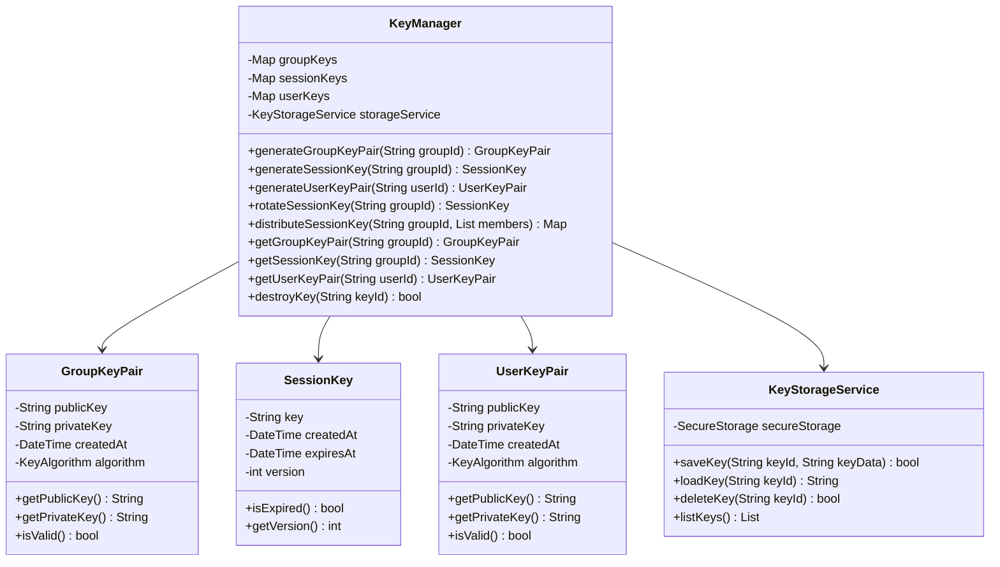
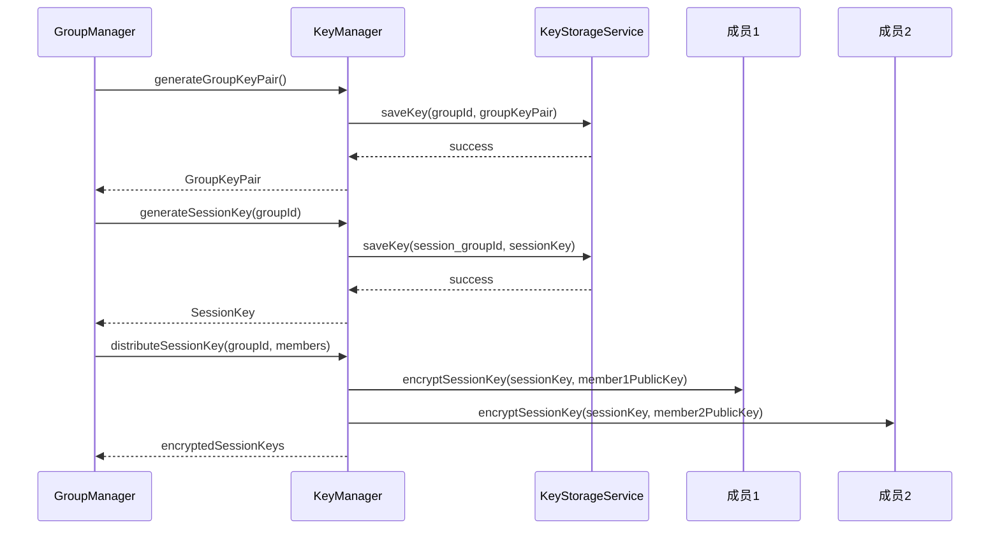
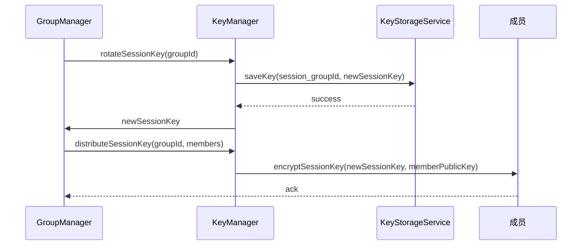
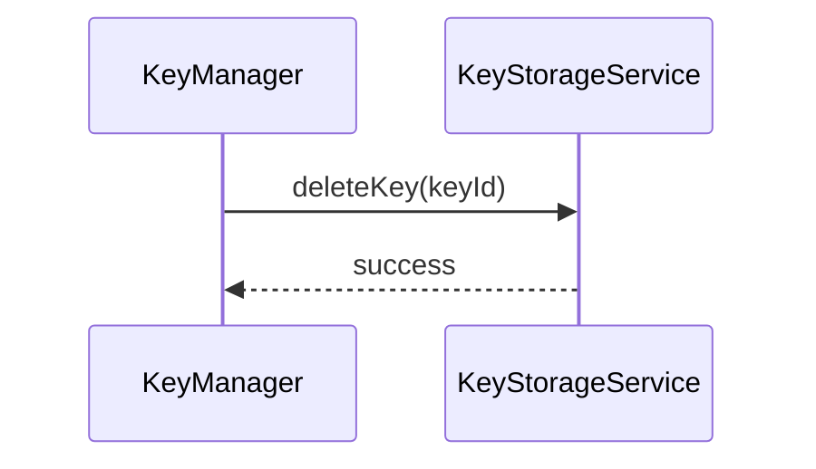

# 加密与密钥管理模块详细设计文档

## 1. 模块概述

加密与密钥管理模块负责群组密钥、会话密钥、个人密钥的生成、分发、轮换、销毁及安全存储，确保端到端加密通信的安全性和密钥生命周期管理。

## 2. 模块结构设计

### 2.1 类结构图



### 2.2 数据结构设计

#### 2.2.1 GroupKeyPair
```dart
class GroupKeyPair {
  final String publicKey;      // 群组公钥
  final String privateKey;     // 群组私钥
  final DateTime createdAt;    // 创建时间
  final KeyAlgorithm algorithm;// 算法类型
}
```

#### 2.2.2 SessionKey
```dart
class SessionKey {
  final String key;            // 会话密钥
  final DateTime createdAt;    // 创建时间
  final DateTime expiresAt;    // 过期时间
  final int version;           // 版本号
}
```

#### 2.2.3 UserKeyPair
```dart
class UserKeyPair {
  final String publicKey;      // 用户公钥
  final String privateKey;     // 用户私钥
  final DateTime createdAt;    // 创建时间
  final KeyAlgorithm algorithm;// 算法类型
}
```

## 3. 核心算法设计

### 3.1 密钥对生成算法
```dart
class KeyGenerator {
  static GroupKeyPair generateGroupKeyPair() {
    // 使用ECDSA或RSA算法生成密钥对
    final keyPair = ECDSAKeyGenerator().generateKeyPair();
    return GroupKeyPair(
      publicKey: keyPair.publicKey,
      privateKey: keyPair.privateKey,
      createdAt: DateTime.now(),
      algorithm: KeyAlgorithm.ecdsa,
    );
  }
  static UserKeyPair generateUserKeyPair() {
    final keyPair = ECDSAKeyGenerator().generateKeyPair();
    return UserKeyPair(
      publicKey: keyPair.publicKey,
      privateKey: keyPair.privateKey,
      createdAt: DateTime.now(),
      algorithm: KeyAlgorithm.ecdsa,
    );
  }
}
```

### 3.2 会话密钥生成与分发算法
```dart
class SessionKeyManager {
  static SessionKey generateSessionKey() {
    final key = _generateRandomKey(32); // 256位
    return SessionKey(
      key: key,
      createdAt: DateTime.now(),
      expiresAt: DateTime.now().add(Duration(hours: 24)),
      version: DateTime.now().millisecondsSinceEpoch,
    );
  }
  static Map<String, String> distributeSessionKey(SessionKey sessionKey, List<Member> members) {
    // 用每个成员的公钥加密会话密钥
    final encryptedKeys = <String, String>{};
    for (final member in members) {
      final encrypted = RSA.encrypt(sessionKey.key, member.publicKey);
      encryptedKeys[member.id] = encrypted;
    }
    return encryptedKeys;
  }
  static String _generateRandomKey(int length) {
    final random = Random.secure();
    final bytes = List<int>.generate(length, (_) => random.nextInt(256));
    return base64Encode(bytes);
  }
}
```

### 3.3 密钥轮换与销毁算法
```dart
class KeyRotationManager {
  static SessionKey rotateSessionKey(String groupId) {
    // 生成新会话密钥并更新版本
    final newKey = SessionKeyManager.generateSessionKey();
    // 持久化新密钥
    KeyStorageService().saveKey('session_$groupId', newKey.key);
    return newKey;
  }
  static bool destroyKey(String keyId) {
    // 从安全存储中删除密钥
    return KeyStorageService().deleteKey(keyId);
  }
}
```

## 4. 时序图设计

### 4.1 群组密钥生成与分发时序图


### 4.2 密钥轮换时序图


### 4.3 密钥销毁时序图


## 5. 接口设计
```dart
abstract class IKeyManager {
  Future<GroupKeyPair> generateGroupKeyPair(String groupId);
  Future<SessionKey> generateSessionKey(String groupId);
  Future<UserKeyPair> generateUserKeyPair(String userId);
  Future<SessionKey> rotateSessionKey(String groupId);
  Future<Map<String, String>> distributeSessionKey(String groupId, List<Member> members);
  GroupKeyPair? getGroupKeyPair(String groupId);
  SessionKey? getSessionKey(String groupId);
  UserKeyPair? getUserKeyPair(String userId);
  Future<bool> destroyKey(String keyId);
}
```

## 6. 错误处理与异常
```dart
class KeyException implements Exception {
  final String message;
  final KeyErrorCode code;
  KeyException(this.message, this.code);
}

enum KeyErrorCode {
  keyGenerationFailed,
  keyDistributionFailed,
  keyRotationFailed,
  keyNotFound,
  keyStorageError,
  keyDestructionFailed
}
```

## 7. 安全与性能
- 密钥仅在安全存储中明文保存，内存中及时清理
- 密钥分发采用端到端加密
- 密钥轮换定期或成员变更时自动触发
- 密钥销毁后无法恢复
- 密钥操作加审计日志

## 8. 测试策略
- 密钥生成/分发/轮换/销毁单元测试
- 密钥存储安全性测试
- 密钥分发正确性与抗篡改测试

---
*本文档为加密与密钥管理模块的详细技术设计，开发时需严格按照此设计实现。* 