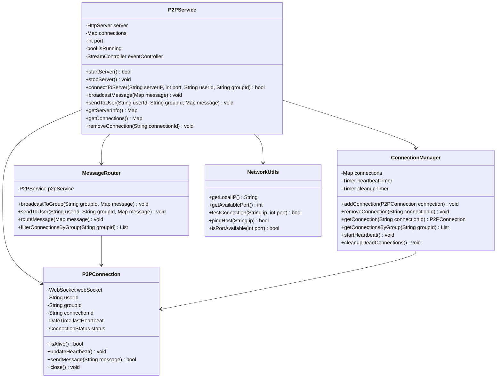
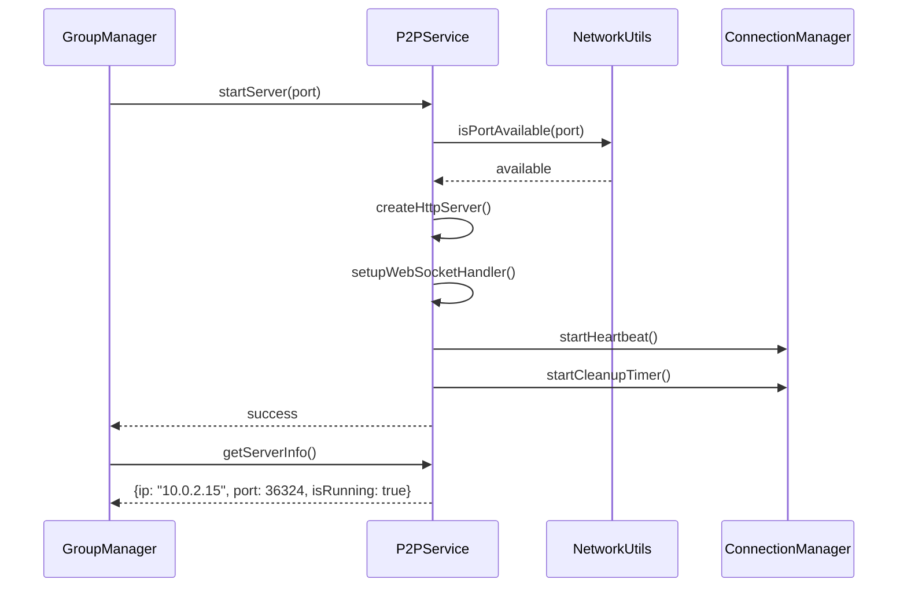
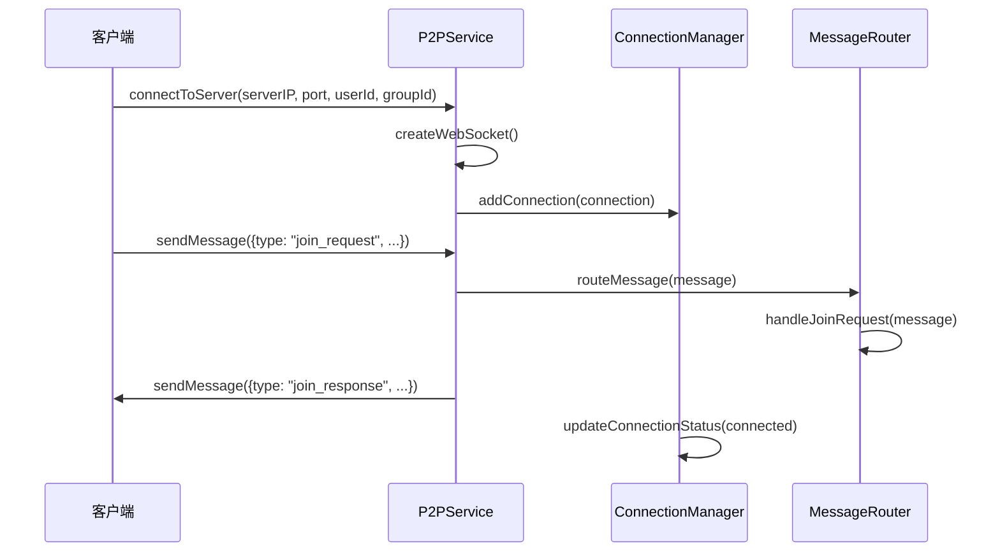
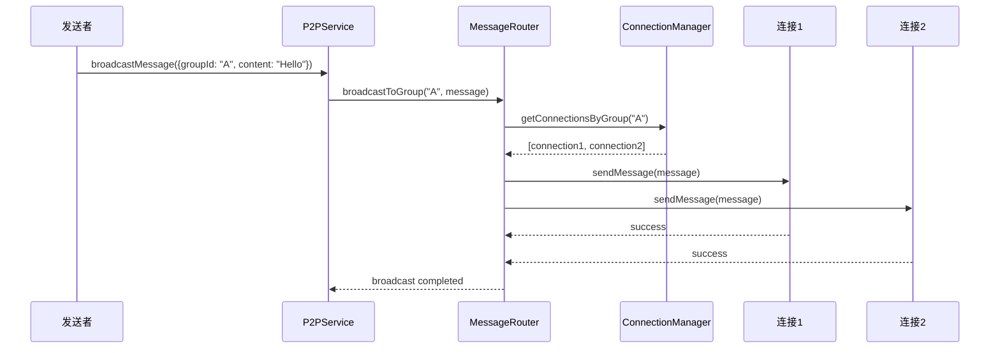

# 网络通信模块详细设计文档

## 1. 模块概述

网络通信模块负责处理P2P网络连接、消息传输、连接管理等核心功能。该模块采用WebSocket协议实现实时双向通信，支持单服务器多群组的架构设计，确保消息的可靠传输和群组隔离。

## 2. 模块结构设计

### 2.1 类结构图



### 2.2 数据结构设计

#### 2.2.1 P2PConnection 数据结构
```dart
class P2PConnection {
  final WebSocket webSocket;          // WebSocket连接
  final String userId;                // 用户ID
  final String groupId;               // 群组ID（关键字段，用于消息路由）
  final String connectionId;          // 连接唯一标识
  DateTime lastHeartbeat;             // 最后心跳时间
  ConnectionStatus status;            // 连接状态
  
  // 连接统计
  int messageCount;                   // 消息计数
  DateTime connectedAt;               // 连接时间
  String? lastError;                  // 最后错误信息
  
  bool isAlive() {
    return DateTime.now().difference(lastHeartbeat) < Duration(seconds: 5);
  }
  
  void updateHeartbeat() {
    lastHeartbeat = DateTime.now();
  }
  
  bool sendMessage(String message) {
    try {
      webSocket.add(message);
      messageCount++;
      return true;
    } catch (e) {
      lastError = e.toString();
      return false;
    }
  }
  
  void close() {
    try {
      webSocket.close();
      status = ConnectionStatus.disconnected;
    } catch (e) {
      lastError = e.toString();
    }
  }
}

enum ConnectionStatus {
  connecting,   // 连接中
  connected,    // 已连接
  disconnected, // 已断开
  error         // 错误状态
}
```

#### 2.2.2 消息数据结构
```dart
class NetworkMessage {
  final String type;                  // 消息类型
  final String messageId;             // 消息ID
  final String groupId;               // 群组ID
  final String senderId;              // 发送者ID
  final dynamic content;              // 消息内容
  final DateTime timestamp;           // 时间戳
  final Map<String, dynamic> metadata; // 元数据
  
  // 消息类型枚举
  static const String TYPE_JOIN_REQUEST = 'join_request';
  static const String TYPE_JOIN_RESPONSE = 'join_response';
  static const String TYPE_CHAT_MESSAGE = 'chat_message';
  static const String TYPE_HEARTBEAT = 'heartbeat';
  static const String TYPE_MEMBER_JOINED = 'member_joined';
  static const String TYPE_MEMBER_LEFT = 'member_left';
  static const String TYPE_GROUP_UPDATE = 'group_update';
  static const String TYPE_ERROR = 'error';
  
  Map<String, dynamic> toJson() {
    return {
      'type': type,
      'messageId': messageId,
      'groupId': groupId,
      'senderId': senderId,
      'content': content,
      'timestamp': timestamp.millisecondsSinceEpoch,
      'metadata': metadata,
    };
  }
  
  factory NetworkMessage.fromJson(Map<String, dynamic> json) {
    return NetworkMessage(
      type: json['type'],
      messageId: json['messageId'],
      groupId: json['groupId'],
      senderId: json['senderId'],
      content: json['content'],
      timestamp: DateTime.fromMillisecondsSinceEpoch(json['timestamp']),
      metadata: json['metadata'] ?? {},
    );
  }
}
```

#### 2.2.3 服务器信息数据结构
```dart
class ServerInfo {
  final String serverIP;              // 服务器IP地址
  final int serverPort;               // 服务器端口
  final bool isRunning;               // 服务器运行状态
  final int connectionCount;          // 当前连接数
  final DateTime startTime;           // 启动时间
  final Map<String, int> groupConnections; // 各群组连接数
  
  Map<String, dynamic> toJson() {
    return {
      'serverIP': serverIP,
      'serverPort': serverPort,
      'isRunning': isRunning,
      'connectionCount': connectionCount,
      'startTime': startTime.millisecondsSinceEpoch,
      'groupConnections': groupConnections,
    };
  }
}
```

## 3. 核心算法设计

### 3.1 WebSocket服务器启动算法
```dart
class P2PService {
  static Future<bool> startServer(int port) async {
    try {
      // 1. 检查端口是否可用
      if (!NetworkUtils.isPortAvailable(port)) {
        throw NetworkException('Port $port is not available');
      }
      
      // 2. 启动HTTP服务器
      server = await HttpServer.bind(InternetAddress.anyIPv4, port);
      
      // 3. 设置WebSocket升级处理器
      server.listen((HttpRequest request) async {
        if (WebSocketTransformer.isUpgradeRequest(request)) {
          WebSocket webSocket = await WebSocketTransformer.upgrade(request);
          _handleNewConnection(webSocket, request);
        } else {
          request.response.statusCode = 400;
          request.response.close();
        }
      });
      
      // 4. 启动心跳检测
      _startHeartbeat();
      
      // 5. 启动清理定时器
      _startCleanupTimer();
      
      isRunning = true;
      _logInfo('P2P server started on port $port');
      return true;
    } catch (e) {
      _logError('Failed to start P2P server', e);
      return false;
    }
  }
  
  static void _handleNewConnection(WebSocket webSocket, HttpRequest request) {
    // 1. 生成连接ID
    final connectionId = _generateConnectionId();
    
    // 2. 设置消息处理器
    webSocket.listen(
      (data) => _handleMessage(connectionId, data),
      onError: (error) => _handleError(connectionId, error),
      onDone: () => _handleDisconnect(connectionId),
    );
    
    // 3. 创建连接对象（初始状态为connecting）
    final connection = P2PConnection(
      webSocket: webSocket,
      connectionId: connectionId,
      status: ConnectionStatus.connecting,
    );
    
    // 4. 添加到连接管理器
    connectionManager.addConnection(connection);
    
    _logInfo('New WebSocket connection: $connectionId');
  }
}
```

### 3.2 消息路由算法
```dart
class MessageRouter {
  static void broadcastToGroup(String groupId, Map<String, dynamic> message) {
    final messageStr = jsonEncode(message);
    final connections = connectionManager.getConnectionsByGroup(groupId);
    
    _logInfo('Broadcasting to group $groupId, connections: ${connections.length}');
    
    for (final connection in connections) {
      if (connection.isAlive()) {
        try {
          final success = connection.sendMessage(messageStr);
          if (!success) {
            _logWarning('Failed to send message to connection ${connection.connectionId}');
            connectionManager.removeConnection(connection.connectionId);
          }
        } catch (e) {
          _logError('Error sending message to connection ${connection.connectionId}', e);
          connectionManager.removeConnection(connection.connectionId);
        }
      } else {
        _logWarning('Removing dead connection: ${connection.connectionId}');
        connectionManager.removeConnection(connection.connectionId);
      }
    }
  }
  
  static void sendToUser(String userId, String groupId, Map<String, dynamic> message) {
    final messageStr = jsonEncode(message);
    final connections = connectionManager.getConnectionsByGroup(groupId);
    
    for (final connection in connections) {
      if (connection.userId == userId && connection.isAlive()) {
        try {
          final success = connection.sendMessage(messageStr);
          if (success) {
            return; // 发送成功，退出
          }
        } catch (e) {
          _logError('Error sending message to user $userId', e);
        }
      }
    }
    
    _logWarning('User $userId not found or not connected in group $groupId');
  }
  
  static void routeMessage(Map<String, dynamic> message) {
    final messageType = message['type'];
    final groupId = message['groupId'];
    
    switch (messageType) {
      case NetworkMessage.TYPE_CHAT_MESSAGE:
        // 聊天消息：广播给群组所有成员
        broadcastToGroup(groupId, message);
        break;
        
      case NetworkMessage.TYPE_JOIN_REQUEST:
        // 加入请求：发送给群组创建者
        _handleJoinRequest(message);
        break;
        
      case NetworkMessage.TYPE_HEARTBEAT:
        // 心跳消息：更新连接状态
        _handleHeartbeat(message);
        break;
        
      case NetworkMessage.TYPE_MEMBER_JOINED:
      case NetworkMessage.TYPE_MEMBER_LEFT:
        // 成员变更：广播给群组所有成员
        broadcastToGroup(groupId, message);
        break;
        
      default:
        _logWarning('Unknown message type: $messageType');
    }
  }
}
```

### 3.3 连接管理算法
```dart
class ConnectionManager {
  static void startHeartbeat() {
    heartbeatTimer = Timer.periodic(Duration(seconds: 30), (timer) {
      _sendHeartbeatToAll();
    });
  }
  
  static void _sendHeartbeatToAll() {
    final heartbeatMessage = NetworkMessage(
      type: NetworkMessage.TYPE_HEARTBEAT,
      messageId: _generateMessageId(),
      groupId: '',
      senderId: '',
      content: null,
      timestamp: DateTime.now(),
      metadata: {},
    );
    
    final messageStr = jsonEncode(heartbeatMessage.toJson());
    
    for (final connection in connections.values) {
      if (connection.isAlive()) {
        try {
          connection.sendMessage(messageStr);
        } catch (e) {
          _logError('Failed to send heartbeat to ${connection.connectionId}', e);
        }
      }
    }
  }
  
  static void cleanupDeadConnections() {
    final deadConnections = <String>[];
    
    for (final entry in connections.entries) {
      final connection = entry.value;
      if (!connection.isAlive()) {
        deadConnections.add(entry.key);
        _logInfo('Marking connection as dead: ${connection.connectionId}');
      }
    }
    
    for (final connectionId in deadConnections) {
      removeConnection(connectionId);
    }
    
    if (deadConnections.isNotEmpty) {
      _logInfo('Cleaned up ${deadConnections.length} dead connections');
    }
  }
  
  static List<P2PConnection> getConnectionsByGroup(String groupId) {
    return connections.values
        .where((connection) => connection.groupId == groupId)
        .toList();
  }
}
```

### 3.4 网络工具算法
```dart
class NetworkUtils {
  static String getLocalIP() {
    try {
      // 获取本地IP地址
      final interfaces = NetworkInterface.list();
      for (final interface in interfaces) {
        for (final addr in interface.addresses) {
          if (addr.type == InternetAddressType.IPv4 && 
              !addr.address.startsWith('127.')) {
            return addr.address;
          }
        }
      }
      return '127.0.0.1';
    } catch (e) {
      return '127.0.0.1';
    }
  }
  
  static Future<int> getAvailablePort() async {
    // 查找可用端口
    for (int port = 36324; port < 36400; port++) {
      if (await isPortAvailable(port)) {
        return port;
      }
    }
    throw NetworkException('No available ports found');
  }
  
  static Future<bool> isPortAvailable(int port) async {
    try {
      final server = await ServerSocket.bind(InternetAddress.anyIPv4, port);
      await server.close();
      return true;
    } catch (e) {
      return false;
    }
  }
  
  static Future<bool> testConnection(String ip, int port) async {
    try {
      final socket = await Socket.connect(ip, port, timeout: Duration(seconds: 5));
      await socket.close();
      return true;
    } catch (e) {
      return false;
    }
  }
}
```

## 4. 时序图设计

### 4.1 服务器启动时序图



### 4.2 客户端连接时序图



### 4.3 消息广播时序图



## 5. 接口设计

### 5.1 P2PService 接口
```dart
abstract class IP2PService {
  // 服务器管理
  Future<bool> startServer([int? port]);
  Future<bool> stopServer();
  bool isServerRunning();
  
  // 客户端连接
  Future<bool> connectToServer(String serverIP, int port, String userId, String groupId);
  Future<bool> disconnect();
  
  // 消息发送
  void broadcastMessage(Map<String, dynamic> message);
  void sendToUser(String userId, String groupId, Map<String, dynamic> message);
  
  // 连接管理
  Map<String, P2PConnection> getConnections();
  int getConnectionCount();
  List<P2PConnection> getConnectionsByGroup(String groupId);
  
  // 服务器信息
  Future<Map<String, dynamic>> getServerInfo();
  Map<String, dynamic> getServerStatus();
  
  // 网络测试
  Future<bool> testConnection(String targetIP, int port);
  Future<bool> pingTest(String targetIP);
  
  // 事件监听
  Stream<ConnectionEvent> get connectionEvents;
  Stream<NetworkMessage> get messageEvents;
}

class ConnectionEvent {
  final ConnectionEventType type;
  final String connectionId;
  final String userId;
  final String groupId;
  final DateTime timestamp;
  final String? error;
}

enum ConnectionEventType {
  connected,
  disconnected,
  messageReceived,
  error,
  heartbeat
}
```

### 5.2 消息处理接口
```dart
abstract class IMessageHandler {
  // 消息处理
  void handleMessage(NetworkMessage message);
  void handleJoinRequest(NetworkMessage message);
  void handleJoinResponse(NetworkMessage message);
  void handleChatMessage(NetworkMessage message);
  void handleHeartbeat(NetworkMessage message);
  
  // 消息创建
  NetworkMessage createJoinRequest(String groupId, String userId, String publicKey);
  NetworkMessage createJoinResponse(bool success, String? sessionKey, String? reason);
  NetworkMessage createChatMessage(String groupId, String senderId, String content);
  NetworkMessage createHeartbeat();
  
  // 消息验证
  bool validateMessage(NetworkMessage message);
  bool validateJoinRequest(NetworkMessage message);
}
```

## 6. 错误处理与异常

### 6.1 异常类型
```dart
class NetworkException implements Exception {
  final String message;
  final NetworkErrorCode code;
  
  NetworkException(this.message, this.code);
}

enum NetworkErrorCode {
  serverStartFailed,
  connectionFailed,
  messageSendFailed,
  messageReceiveFailed,
  invalidMessage,
  connectionTimeout,
  serverUnavailable,
  portUnavailable,
  networkUnreachable
}
```

### 6.2 错误处理策略
```dart
class NetworkErrorHandler {
  static Future<T> handleNetworkOperation<T>(
    Future<T> Function() operation,
    String operationName,
  ) async {
    try {
      return await operation();
    } on NetworkException catch (e) {
      _logError('Network error in $operationName', e);
      _handleNetworkError(e);
      rethrow;
    } on SocketException catch (e) {
      _handleSocketError(e);
      rethrow;
    } catch (e) {
      _handleUnexpectedError(e);
      rethrow;
    }
  }
}
```

## 7. 性能优化

### 7.1 连接池管理
- 连接复用机制
- 连接数量限制
- 连接超时处理
- 连接健康检查

### 7.2 消息处理优化
- 消息队列缓冲
- 批量消息处理
- 消息压缩传输
- 异步消息处理

### 7.3 网络优化
- 心跳机制优化
- 断线重连策略
- 网络状态监控
- 带宽使用优化

## 8. 安全考虑

### 8.1 连接安全
- WebSocket连接验证
- 消息格式验证
- 连接数量限制
- 异常连接检测

### 8.2 消息安全
- 消息完整性检查
- 消息来源验证
- 消息重放防护
- 敏感信息过滤

### 8.3 网络安全
- 网络流量监控
- 异常行为检测
- 连接日志记录
- 安全事件响应

## 9. 测试策略

### 9.1 单元测试
- 消息路由算法
- 连接管理逻辑
- 网络工具函数
- 错误处理机制

### 9.2 集成测试
- 端到端网络通信
- 多客户端并发测试
- 网络异常恢复测试
- 消息传输可靠性测试

### 9.3 性能测试
- 连接并发数测试
- 消息吞吐量测试
- 网络延迟测试
- 内存使用测试

---

*本文档为网络通信模块的详细技术设计，开发时需严格按照此设计实现。* 