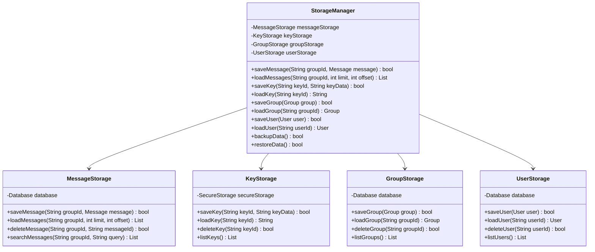
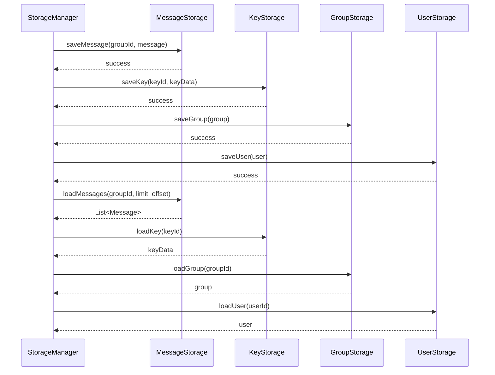
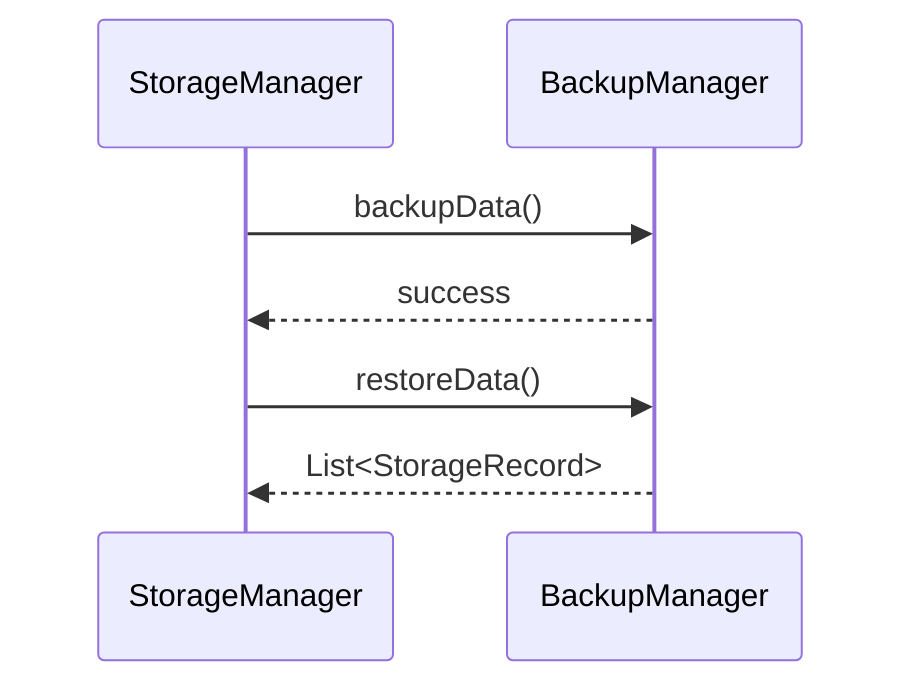

# 本地存储模块详细设计文档

## 1. 模块概述

本地存储模块负责消息、密钥、群组、用户等数据的本地持久化、安全存储与高效访问，支持多端同步和数据备份。

## 2. 模块结构设计

### 2.1 类结构图



### 2.2 数据结构设计

#### 2.2.1 存储数据结构
```dart
class StorageRecord {
  final String id;                // 记录唯一标识
  final String type;              // 数据类型（message/key/group/user）
  final String data;              // 序列化数据
  final DateTime createdAt;       // 创建时间
  final DateTime updatedAt;       // 更新时间
}
```

## 3. 核心算法设计

### 3.1 数据加密存储算法
```dart
class SecureStorage {
  static bool saveEncrypted(String key, String data, String encryptionKey) {
    // 1. 加密数据
    final encrypted = AES.encrypt(data, encryptionKey);
    // 2. 存储加密数据
    return _saveToDisk(key, encrypted);
  }
  static String loadDecrypted(String key, String encryptionKey) {
    // 1. 读取加密数据
    final encrypted = _loadFromDisk(key);
    // 2. 解密数据
    return AES.decrypt(encrypted, encryptionKey);
  }
  static bool _saveToDisk(String key, String data) {
    // 实际磁盘写入逻辑
    return true;
  }
  static String _loadFromDisk(String key) {
    // 实际磁盘读取逻辑
    return '';
  }
}
```

### 3.2 数据备份与恢复算法
```dart
class BackupManager {
  static bool backupData(List<StorageRecord> records, String backupPath) {
    // 1. 序列化所有数据
    final jsonData = jsonEncode(records.map((r) => r.toJson()).toList());
    // 2. 写入备份文件
    return _writeToFile(backupPath, jsonData);
  }
  static List<StorageRecord> restoreData(String backupPath) {
    // 1. 读取备份文件
    final jsonData = _readFromFile(backupPath);
    // 2. 反序列化数据
    final data = jsonDecode(jsonData) as List;
    return data.map((e) => StorageRecord.fromJson(e)).toList();
  }
  static bool _writeToFile(String path, String data) {
    // 实际文件写入逻辑
    return true;
  }
  static String _readFromFile(String path) {
    // 实际文件读取逻辑
    return '';
  }
}
```

### 3.3 数据同步算法（多端同步）
```dart
class SyncManager {
  static Future<bool> syncData(List<StorageRecord> localRecords, List<StorageRecord> remoteRecords) async {
    // 1. 比较本地与远程数据
    // 2. 合并差异
    // 3. 更新本地和远程
    return true;
  }
}
```

## 4. 时序图设计

### 4.1 数据存储与读取时序图


### 4.2 数据备份与恢复时序图


## 5. 接口设计
```dart
abstract class IStorageManager {
  Future<bool> saveMessage(String groupId, Message message);
  Future<List<Message>> loadMessages(String groupId, int limit, int offset);
  Future<bool> saveKey(String keyId, String keyData);
  Future<String?> loadKey(String keyId);
  Future<bool> saveGroup(Group group);
  Future<Group?> loadGroup(String groupId);
  Future<bool> saveUser(User user);
  Future<User?> loadUser(String userId);
  Future<bool> backupData();
  Future<bool> restoreData();
}
```

## 6. 错误处理与异常
```dart
class StorageException implements Exception {
  final String message;
  final StorageErrorCode code;
  StorageException(this.message, this.code);
}

enum StorageErrorCode {
  saveFailed,
  loadFailed,
  deleteFailed,
  backupFailed,
  restoreFailed,
  encryptionError,
  dataCorrupted
}
```

## 7. 安全与性能
- 所有敏感数据加密存储
- 备份文件加密与签名
- 数据分页加载与懒加载
- 定期自动备份与恢复
- 存储操作加审计日志

## 8. 测试策略
- 消息/密钥/群组/用户存储单元测试
- 加密存储安全性测试
- 备份与恢复正确性测试
- 数据同步一致性测试

---
*本文档为本地存储模块的详细技术设计，开发时需严格按照此设计实现。* 